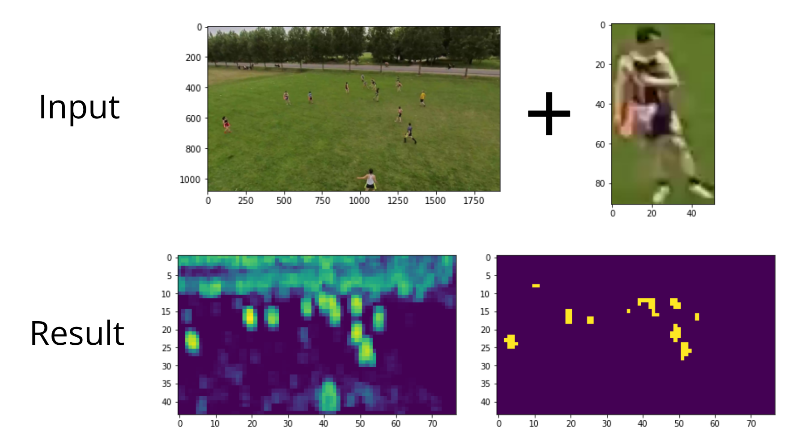

# One shot multi object detection (for sports)
Experiment to see if you can apply heuristic techniques combined with pre-trained models to quickly predict multiple similare object within a single image. To be applied to finding multiple players on a playing field.

